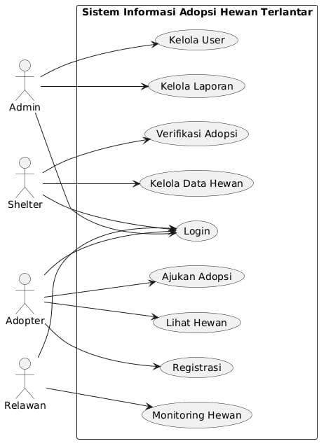
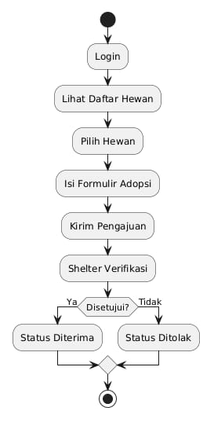
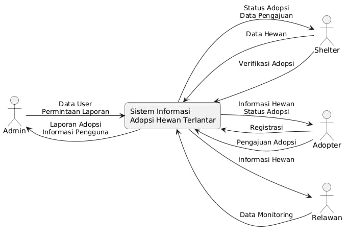
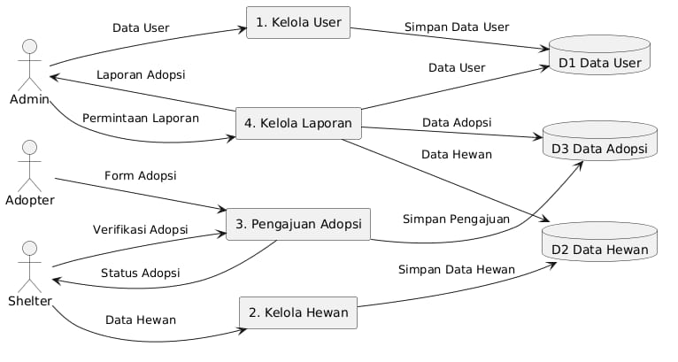
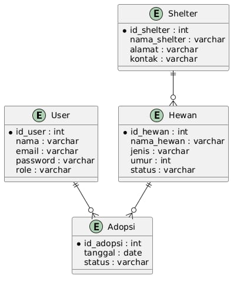
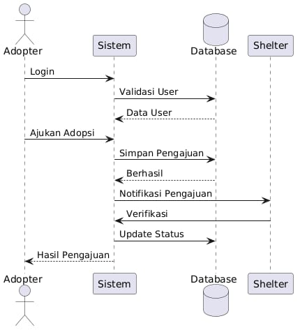

# Analisis dan Perancangan Sistem Informasi Adopsi Hewan Terlantar

## Deskripsi Proyek

Sistem Informasi Adopsi Hewan Terlantar merupakan sistem berbasis web yang dirancang untuk membantu proses pendataan, pengelolaan, dan adopsi hewan terlantar secara digital dan terintegrasi. Sistem ini menghubungkan shelter, relawan, dan calon adopter dalam satu platform sehingga proses adopsi menjadi lebih mudah, cepat, dan transparan.

Melalui sistem ini, shelter dapat mengelola data hewan yang tersedia untuk diadopsi, calon adopter dapat mencari hewan sesuai preferensi, serta proses pengajuan dan persetujuan adopsi dapat dilakukan secara online.

## Tujuan Proyek

- Mempermudah proses adopsi hewan terlantar.
- Meningkatkan peluang hewan mendapatkan keluarga baru.
- Mendigitalisasi proses pendataan hewan dan adopter.
- Menyediakan informasi hewan secara lengkap dan transparan.
- Mempermudah pengelolaan data shelter dan relawan.
- Mengurangi jumlah hewan terlantar di lingkungan masyarakat.

## Latar Belakang

Masih banyak hewan terlantar yang tidak mendapatkan tempat tinggal dan perawatan yang layak. Selain itu, proses adopsi yang masih dilakukan secara manual sering menimbulkan berbagai kendala seperti sulitnya masyarakat memperoleh informasi hewan yang dapat diadopsi, data hewan yang tidak terdokumentasi dengan baik, serta proses seleksi adopter yang memerlukan waktu cukup lama.

Untuk mengatasi permasalahan tersebut, diperlukan sebuah sistem informasi yang mampu mengelola proses adopsi hewan secara digital dan terintegrasi.

## Kebutuhan Sistem

### Sistem harus mampu:

- Menyimpan data hewan yang tersedia untuk diadopsi.
- Menyimpan data calon adopter.
- Mengelola pengajuan adopsi secara online.
- Menampilkan status proses adopsi.
- Mengelola data shelter dan relawan.
- Menyediakan laporan data adopsi.

## Fitur Utama

- Manajemen Pengguna
- Login dan autentikasi pengguna.
- Registrasi calon adopter.
- Pengelolaan hak akses pengguna.
- Manajemen profil pengguna.
- Manajemen Hewan
- Tambah data hewan.
- Edit data hewan.
- Upload foto hewan.
- Kelola status hewan.

## Status hewan:

- Tersedia
- Dalam Proses Adopsi
- Sudah Diadopsi
  
## Pengajuan Adopsi
- Pengisian formulir adopsi.
- Upload dokumen pendukung.
- Verifikasi data adopter.
- Persetujuan atau penolakan adopsi.

## Monitoring Adopsi

- Tracking status pengajuan.
- Riwayat adopsi.
- Monitoring hewan yang telah diadopsi.

## Pelaporan

- Laporan jumlah hewan.
- Laporan data adopter.
- Laporan adopsi bulanan.
- Export PDF.
- Export Excel.

## Aktor Sistem

| Aktor | Tugas |
|--------|--------|
| Admin | Mengelola seluruh data sistem |
| Shelter | Mengelola data hewan dan pengajuan adopsi |
| Calon Adopter | Mengajukan adopsi dan melihat status |
| Relawan | Membantu pendataan dan monitoring hewan |

## Ruang Lingkup Sistem
### In Scope

- Registrasi dan login pengguna.
- Manajemen data hewan.
- Pengajuan adopsi online.
- Monitoring status adopsi.
- Laporan adopsi.
- Manajemen data shelter.

### Out of Scope

- Pembayaran online.
- Konsultasi dokter hewan.
- Marketplace perlengkapan hewan.
- Aplikasi mobile Android dan iOS.
- Integrasi media sosial.

## Teknologi yang Digunakan

### Frontend
- HTML
- CSS
- JavaScript

### Backend
- REST API

### Database

- MySQL

### Storage

- Penyimpanan foto hewan.

## Diagram Sistem

### Use Case Diagram

### Activity Diagram

### DFD Level 0

### DFD Level 1

### ERD

### Sequence Diagram

## Struktur Aktor dan Hak Akses

| Role | Hak Akses |
|--------|--------|
| Admin | Mengelola seluruh data sistem, pengguna, shelter, dan laporan |
| Shelter | Mengelola data hewan, memverifikasi pengajuan adopsi, dan mengubah status hewan |
| Relawan | Membantu pendataan hewan serta monitoring kondisi hewan |
| Adopter | Registrasi, login, melihat data hewan, mengajukan adopsi, dan memantau status adopsi |

## Manfaat Sistem

### Manfaat Kuantitatif

- Mengurangi waktu proses administrasi adopsi.
- Mempercepat pencarian calon adopter yang sesuai.
- Mempermudah pengelolaan data hewan dan adopter.
- Meningkatkan jumlah adopsi hewan setiap tahun.

### Manfaat Kualitatif

- Meningkatkan transparansi proses adopsi.
- Membantu kesejahteraan hewan terlantar.
- Mempermudah komunikasi antara shelter dan adopter.
- Mendukung digitalisasi pengelolaan shelter.
- Memudahkan monitoring status hewan yang telah diadopsi.

## Tim Pengembang

| Posisi | Jumlah |
|---------|---------|
| Project Manager | 1 |
| System Analyst | 1 |
| UI/UX Designer | 1 |
| Frontend Developer | 1 |
| Backend Developer | 2 |
| Database Administrator | 1 |
| Quality Assurance (QA) Engineer | 1 |

## Estimasi Waktu Pengembangan

| Tahap | Durasi |
|---------|---------|
| Analisis Kebutuhan | 2 Minggu |
| Penyusunan BRD | 1 Minggu |
| Perancangan Diagram Sistem | 2 Minggu |
| Perancangan Database | 1 Minggu |
| Desain UI/UX | 2 Minggu |
| Pengembangan Backend | 3 Minggu |
| Pengembangan Frontend | 3 Minggu |
| Pengujian Sistem | 1 Minggu |
| Dokumentasi dan Deployment | 1 Minggu |

**Total Durasi Proyek: 16 Minggu (4 Bulan)**

## Kesimpulan

Sistem Informasi Adopsi Hewan Terlantar merupakan solusi digital yang dirancang untuk membantu proses pendataan, pengelolaan, dan adopsi hewan terlantar secara efektif dan terintegrasi. Dengan adanya fitur manajemen hewan, pengajuan adopsi online, monitoring proses adopsi, serta pelaporan yang terstruktur, sistem ini dapat meningkatkan efisiensi pengelolaan shelter dan membantu lebih banyak hewan mendapatkan keluarga baru yang layak.

Melalui sistem ini, proses adopsi menjadi lebih transparan, cepat, dan mudah diakses oleh masyarakat sehingga dapat berkontribusi dalam mengurangi jumlah hewan terlantar serta meningkatkan kesejahteraan hewan.
